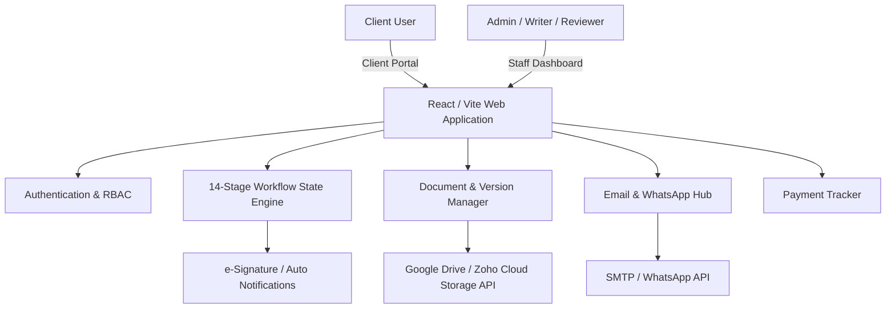
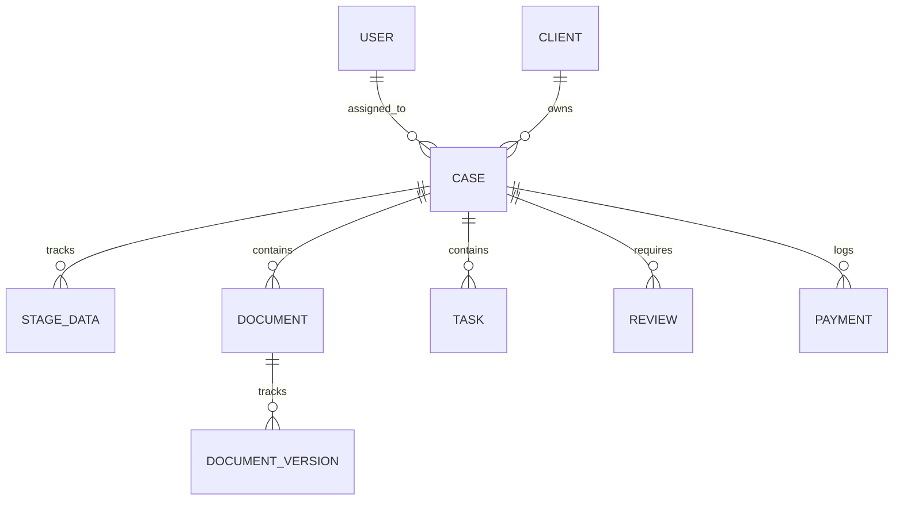
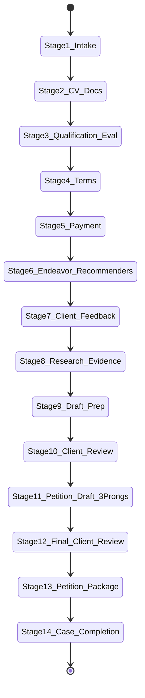

# EB-2 NIW System Architecture & Logic Register (Brain)

---

## 1. System High-Level Architecture

---

## 2. Entity-Relationship Data Models

### 2.1 Core Entities

### 2.2 Entity Schemas

1. **User**
   - `id`: UUID
   - `name`: String
   - `email`: String
   - `role`: Enum (`ADMINISTRATOR`, `PETITION_WRITER`, `REVIEWER`, `CLIENT`)
   - `status`: Enum (`ACTIVE`, `DISABLED`)

2. **Client**
   - `id`: UUID
   - `first_name`: String
   - `last_name`: String
   - `email`: String
   - `phone`: String
   - `current_stage`: Integer (1..14)
   - `assigned_staff_id`: UUID -> User

3. **Case**
   - `id`: UUID
   - `case_number`: String (e.g. `NIW-2026-001`)
   - `client_id`: UUID -> Client
   - `case_type`: String (`EB-2 NIW`)
   - `current_stage`: Integer (1..14)
   - `priority`: Enum (`LOW`, `MEDIUM`, `HIGH`, `URGENT`)
   - `status`: Enum (`ACTIVE`, `PENDING_REVIEW`, `COMPLETED`, `ARCHIVED`)
   - `start_date`: Date
   - `completion_date`: Date (nullable)

4. **14 Stage Data State Engine**
   - Stage 1: `intake_questionnaire_status`, `registration_status`
   - Stage 2: `cv_uploaded`, `supporting_docs_uploaded`, `approved`
   - Stage 3: `qual_review`, `exp_review`, `achievement_review`, `endeavor_review`
   - Stage 4: `engagement_acceptance_status` (`PENDING`, `ACCEPTED`)
   - Stage 5: `payment_status` (`PENDING`, `PARTIAL`, `PAID`)
   - Stage 6: `proposed_endeavor_text`, `recommender_list`
   - Stage 7: `feedback_text`, `recommender_cvs`, `evidence_docs`
   - Stage 8: `research_notes`, `national_importance_evidence`
   - Stage 9: `endeavor_draft`, `recommendation_drafts`
   - Stage 10: `client_comments`, `client_approval_status`
   - Stage 11: `prong1_doc_id`, `prong2_doc_id`, `prong3_doc_id`
   - Stage 12: `final_client_comments`, `final_approval_status`
   - Stage 13: `petition_package_status`, `documents_organized`
   - Stage 14: `completion_date`, `record_storage_status`

5. **Document & Document Version**
   - `id`: UUID
   - `case_id`: UUID -> Case
   - `document_name`: String
   - `category`: Enum (`CV`, `INTAKE_QUESTIONNAIRE`, `ACADEMIC_RECORDS`, `EMPLOYMENT_RECORDS`, `PUBLICATIONS`, `AWARDS`, `MEMBERSHIPS`, `RECOMMENDATION_LETTERS`, `PETITION_DRAFTS`, `SUPPORTING_EVIDENCE`, `OTHER_EVIDENCE`)
   - `current_version`: Integer
   - `status`: Enum (`PENDING`, `REVIEWED`, `APPROVED`, `REJECTED`)
   - `version_history`: Array of `{ version, uploaded_by, upload_date, file_url, notes }`

---

## 3. Workflow State Transition Engine

---

## 4. Background Automation & Integration Logic

1. **Document Sync Service:** Automatically pushes uploaded files to configured cloud storage (Google Drive or Zoho Cloud Storage).
2. **Notification Cron Scheduler:**
   - Evaluates open tasks and document requests daily.
   - Dispatches automated reminders via Email SMTP / WhatsApp API.
3. **Audit Trail Logger:** Listens to all mutation events across Cases, Documents, Tasks, and Reviews to write structured logs into `Activity History`.
